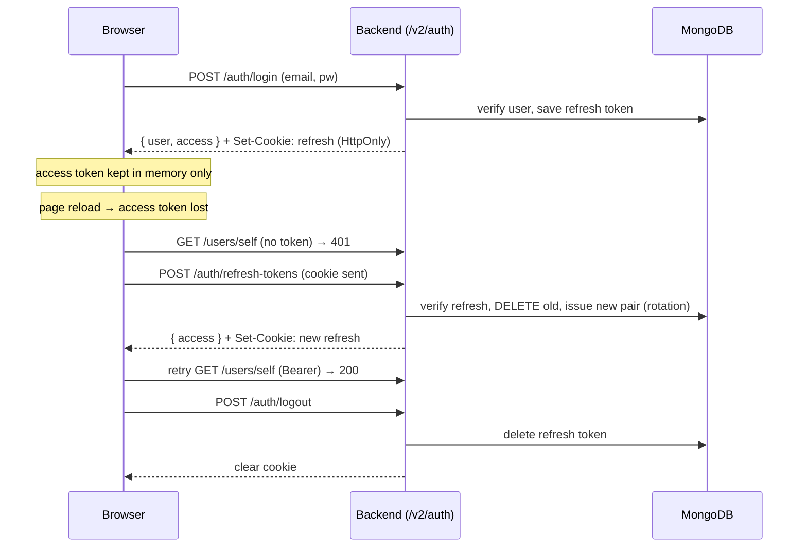

# Authentication, Authorization & Security

AutoWRX uses **JWT** access tokens (Bearer header, in-memory on the client) plus
**rotating refresh tokens** delivered as HttpOnly cookies. Authorization is
resource-scoped RBAC enforced on the server. This document is code-verified;
where the existing security docs disagree with the code, the **code wins** and
the gap is flagged.

---

## 1. Token model

| Token | Where it lives | Lifetime (default) | Persisted? |
|---|---|---|---|
| **Access** | Frontend **memory** (`authStore.access`), sent as `Authorization: Bearer` | 30 min (production); in **dev** the unit is overridden to *days*, so it is 30 days | No |
| **Refresh** | **HttpOnly cookie** (`JWT_COOKIE_NAME`, default `token`) | 30 days | Yes — `tokens` collection |
| Reset-password / verify-email | — | 10 min | Yes — `tokens` collection |

The `Token` model (`models/token.model.js`) stores only refresh / reset / verify
types; **access tokens are never stored**. There is no TTL index — expiry is
enforced at verification time by `jwt.verify`, and refresh docs are deleted on
rotation/logout.

---

## 2. Authentication flow

Strategy: a single Passport **`passport-jwt`** strategy (`config/passport.js`).
Tokens are read from the `Authorization` header only. `jwtVerify` rejects any
token whose `type !== 'access'`, then resolves the subject as a `User` **or an
`Asset`** — assets are first-class principals that can authenticate for
service-to-service use.

### Login → refresh → logout



Key properties (verified in `auth.service.js` / `auth.controller.js`):

- **Login** issues both tokens; the controller sets the refresh cookie and
  **deletes `tokens.refresh` from the JSON body** — the client only ever sees
  the access token.
- **Refresh** reads the token from the **cookie** (not the body), verifies it in
  the DB, **deletes the old refresh doc, and issues a brand-new pair** — refresh
  tokens are **single-use / rotated**.
- **SSO** (GitHub, MS Graph) is handled manually in the auth service/controller
  (no Passport OAuth strategy); auto-provisioning is gated by
  `SSO_AUTO_REGISTRATION`.

### Two 401→refresh paths on the frontend

There are **two independent** refresh mechanisms, each with its own
`isRefreshing` single-flight guard:

1. **axios response interceptor** (`services/base.ts`) — refreshes and replays
   the failed request (queuing concurrent ones).
2. **React-Query `QueryCache.onError`** (`providers/QueryProvider.tsx`) —
   refreshes and invalidates the query.

Both skip the `/auth/*` endpoints and call `logOut()` on refresh failure.
The bootstrap sequence: `App` renders → `useSelfProfile` is disabled until
`authBootstrapped && access` → the refresh flow populates the store → self-profile
loads.

---

## 3. Cookies

Configured in `config/config.js`:

```js
cookie.name    = JWT_COOKIE_NAME || 'token'
cookie.options = {
  httpOnly: true,                                   // always
  secure:   NODE_ENV === 'production',              // true prod / false dev
  sameSite: NODE_ENV === 'production' ? 'None' : 'Lax',
  ...(production ? { domain: JWT_COOKIE_DOMAIN } : {}),
}
```

Only the refresh token is stored here. The dev/prod split (SameSite=Lax + no
domain locally vs SameSite=None; Secure; domain in prod) exists because
production-grade cookie flags break `localhost`. `app.set('trust proxy', true)`
ensures `Secure` works behind a TLS-terminating proxy. Full rationale:
[authentication-cookie-handling.md](../reference/authentication-cookie-handling.md) (matches
current code).

---

## 4. Authorization (RBAC)

Enforcement is **server-side**: write routes chain
`auth() → checkPermission(PERMISSION) → validate → controller`.

### The v1 model (primary — `config/roles.js`, `services/permission.service.js`)

- **Permissions**: `READ_MODEL`, `WRITE_MODEL`, `MANAGE_USERS` (=`manageUsers`),
  `UNLIMITED_MODEL`, `READ_ASSET`, `WRITE_ASSET`, `GENERATIVE_AI`,
  `DEPLOY_HARDWARE`, `LEARNING_MODE`, `AI_AGENT`.
- **Roles** (bundles applied to resources you don't own): `model_contributor`
  (read+write), `model_member` (read), `admin` (broad), plus feature roles.
- **`hasPermission(userId, permission, id, type)`**:
  - **Owner always allowed** (`created_by` match; for a prototype, the parent
    model's owner too).
  - Otherwise look up the user's `UserRole` docs, build a `ref → [permissions]`
    map, and grant if the **global `*`** role (admin-style) or the **specific
    resource id's** role contains the permission.
  - `listReadableModelIds` returns `'*'` for global readers, else the union of
    owned + public + role-granted models (drives list filtering).

Roles are stored per user, per resource, in the `userroles` collection (see
[data-model.md](./data-model.md)).

### The Casbin "v2" model (secondary — `config/rolesV2.js`)

A newer **Casbin** enforcer (`casbin-mongoose-adapter`, model `rolesModel.conf`)
seeds `owner/writer/reader → read/write` grouping policies and is reachable via
`permissionService.hasPermissionV2` and the internal `/authorize` endpoint. The
two systems coexist.

### Frontend permission checks

`hooks/usePermissionHook.ts` batches `[permission, resourceId]` tuples into
`GET /v2/permissions/has-permission` and returns a `boolean[]` — **defaulting to
denied** when auth isn't ready. This is **UX gating only**; the API re-checks
every request. There is no `ProtectedRoute` wrapper — soft gating uses
`DaRequireSignedIn` + `usePermissionHook`.

> **Note:** the permission constants are duplicated in
> `frontend/src/const/permission.ts` **and** `frontend/src/data/permission.ts`
> (identical) — a cleanup candidate.

---

## 5. Site auth configs (feature gates)

`middlewares/authConfig.js` loads four flags into `req.authConfig` on every
request (secure default: all `false`):

| Flag | Effect |
|---|---|
| **`PUBLIC_VIEWING`** | Passed as the `optional` predicate to `auth()` on read routes → anonymous users can view public models/APIs/feedback. When false, those routes require a token. |
| **`SELF_REGISTRATION`** | Gates `POST /auth/register` (403 when disabled). |
| **`SSO_AUTO_REGISTRATION`** | Whether an unknown SSO email auto-creates a user. |
| **`PASSWORD_MANAGEMENT`** | Gates password reset/change UI. |

Resolution (`utils/siteConfig.js`): DB site-config first (5-min cache), else fall
back to the `STRICT_AUTH` env — `STRICT_AUTH=false` opens all flags,
`STRICT_AUTH=true`/unset closes them. The frontend mirrors these via
`hooks/useAuthConfigs.ts` (used by `DaRequireSignedIn` and `FormSignIn`).

---

## 6. Transport security

- **CORS** (`config/config.js`) — `origin` is a function validating each request
  against a **regex allowlist** built from `CORS_ORIGINS` (auto-prefixed
  `http`/`https`); `credentials: true` for the cross-site refresh cookie. Matches
  [CORS_CONFIGURATION.md](../reference/cors.md).
- **Helmet / CSP** — set in `app.js` for both dev and prod. **⚠️ Reality check:**
  the shipped CSP is effectively **wildcard-open** (`defaultSrc ['*']`,
  `scriptSrc [... '*']`, `connectSrc ['*']`); only `objectSrc: 'none'` is
  meaningfully restrictive. This **contradicts
  [CSP_CONFIGURATION.md](../reference/csp.md)**, which describes a tight,
  CDN-allowlisted policy. The doc is aspirational; today CSP provides limited XSS
  mitigation. *(Flagged for follow-up — tightening the real CSP is worth a
  dedicated task.)*
- **`express-mongo-sanitize`** strips `$`/`.` keys (Mongo operator injection).
- Body parsers capped at 50 MB; central `errorConverter` + `errorHandler`.
  > Note: an `authLimiter` (20 req / 15 min) is *defined* in
  > `middlewares/rateLimiter.js` but is **not currently applied to any route**,
  > so auth endpoints are effectively unrate-limited (see "Known gaps").

---

## 7. Security posture — known gaps

Called out honestly so newcomers don't assume more hardening than exists:

- **CSP is wildcard-open** despite the restrictive doc (§6).
- **Plugins run same-origin, unsandboxed** (see
  [plugin-system.md](./plugin-system.md)) — iframe isolation is future work.
- The **internal-plugin upload** route's admin permission check is currently
  commented out.
- **Auth routes are not rate-limited** — `authLimiter` is defined in
  `middlewares/rateLimiter.js` but not applied to any route (§6), so login /
  register / etc. have no brute-force throttling.
- Permission constants are duplicated on the frontend (§4).

---

*Next: [plugin-system.md](./plugin-system.md) · [data-model.md](./data-model.md)*
