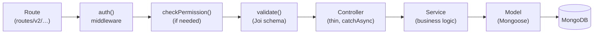

# Backend Architecture

The backend is a **Node.js + Express 4** REST API in `backend/`. It owns
persistence (MongoDB via Mongoose), authentication and authorization, the model
/ prototype / plugin / template domains, and — in production — **serving the
built frontend**. Its structure follows the `hagopj13/node-express-boilerplate`
layout, extended heavily.

Runs on **`:3200`** in development (`yarn dev`, nodemon). See
[README](./README.md) for the stack table.

---

## 1. Bootstrap & global middleware

`src/index.js` connects Mongoose, runs startup scripts
(`initializeRoles → assignAdmins → seedPredefinedSiteConfigs / seedProjectTemplates`),
starts the HTTP server, initializes Socket.IO, and registers global
`uncaughtException` / `unhandledRejection` handlers.

`src/app.js` builds the Express app with this **ordered** middleware chain:

```
morgan (Winston access logs)
→ cookie-parser
→ helmet  (env-specific CSP: permissive in dev, restrictive in prod)
→ express.json  ({ limit: '50mb', strict: false })
→ express.urlencoded
→ express-mongo-sanitize
→ compression (gzip)
→ cors  (custom origin allowlist from CORS_ORIGINS)
→ passport.initialize() + jwt strategy
→ loadAuthConfigs  (site auth flags → req.authConfig)
→ /v2  → routesV2
→ static mounts  (/static, /plugin, /images, /builtin-widgets, /vss/:version/:file …)
→ (prod) frontend proxy / SPA fallback
→ 404 handler → errorConverter → errorHandler
```

---

## 2. The request pipeline

Every domain endpoint flows through the same layered pipeline:



Each layer has one job:

- **Route** — declares the path + the middleware/handler chain, e.g.
  `POST /prototypes` = `auth(), validate(createPrototype), prototypeController.createPrototype`.
- **`auth()`** (`middlewares/auth.js`) — verifies the JWT (Passport) and attaches
  `req.user`. Supports `auth({ optional })` where `optional` can be a function of
  the request — used with `PUBLIC_VIEWING` so anonymous users can read public
  models.
- **`checkPermission()`** (`middlewares/permission.js`) — resolves the resource
  id and asks `permissionService.hasPermission()`; throws **403** if denied.
- **`validate()`** (`middlewares/validate.js`) — compiles the Joi schema
  (`abortEarly:false`), validates `params/query/body`, and throws
  `ApiError(400, …)` with all messages joined.
- **Controller** — thin, wrapped in `catchAsync`; extracts input with `pick`,
  does coarse permission checks, calls a service, sends the response, optionally
  runs a **decorator** (see [§6](#6-decorators--typedefs)).
- **Service** — owns all logic and the only place that touches Mongoose models.
- **Model** — the Mongoose schema (see [data-model.md](./data-model.md)).

---

## 3. Route groups (`routes/v2/`)

All sub-routers mount flat under `/v2`. Four groups:

| Group | Owns |
|---|---|
| **user-management** | `/users` (CRUD + `/self`), `/auth` (login, logout, register, `refresh-tokens`, github SSO, forgot/reset password, verify email), `/assets` (CRUD + token + permissions), `/permissions` (self, roles, has-permission) |
| **vehicle-data** | `/prototypes` (+ `/recent`, `/popular`, `/execute-code`), `/models` (+ `/all`, `/stats`, `/replace-api`, `/api`, `/permissions`), `/apis` (VSS/CVI), `/extendedApis` (wishlist), `/custom-api-sets` |
| **content** | `/discussions`, `/feedbacks` |
| **system** | `/health`, `/search`, `/change-logs`, `/file`, `/site-config`, `/plugin`, `/model-template`, `/dashboard-template`, `/project-template`, `/custom-api-schema`, `/genai` (proxied) |

---

## 4. Middlewares (`middlewares/`)

| Middleware | Role |
|---|---|
| `auth.js` | JWT auth (Passport); can delegate to an external auth service (`AUTH_URL`); `optional` gate for public viewing |
| `authConfig.js` | Preloads site auth flags (`PUBLIC_VIEWING`, `SELF_REGISTRATION`, `SSO_AUTO_REGISTRATION`, `PASSWORD_MANAGEMENT`) into `req.authConfig`; fails safe to all-false |
| `permission.js` | `checkPermission(permission, type)` → 403 on failure |
| `validate.js` | Joi validation → `ApiError(400)` |
| `error.js` | `errorConverter` + `errorHandler` (see [§7](#7-error-handling--logging)) |
| `rateLimiter.js` | `authLimiter` — 20 req / 15 min, skips successful requests |
| `upload.js` | Multer disk storage → `static/uploads/<date>/`, 50 MB limit |

---

## 5. Controllers & services

Controllers (`controllers/*.controller.js`, aggregated in `index.js`) stay
**thin** — each handler is a `catchAsync` wrapper that picks input, does a coarse
permission check, calls a service, and responds. No controller in the verified
paths touches Mongoose directly.

Services (`services/*.service.js`) own **all** business logic and DB access.
Beyond CRUD, notable services: `permission.service` (the authorization core —
see [auth-security.md](./auth-security.md)), `listener.service` (Socket.IO
helpers for OAuth push), `token.service`, `email.service`, `sso.service`,
`log.service`.

---

## 6. Decorators & typedefs

- **`decorators/`** — GoF-style result decorators that post-process query
  results before serialization. E.g. `FeedbackPrototypeDecorator` enriches a
  prototype with `avg_score`; `ParsedJsonPropertiesMongooseDecorator` parses
  JSON-string fields into objects. Applied in controllers on read paths.
- **`typedefs/`** — JSDoc-only type stubs for editor tooling (no runtime
  behavior).

---

## 7. Error handling & logging

- **`utils/ApiError.js`** — `ApiError extends Error` with `statusCode` +
  `isOperational`. The canonical domain error, thrown throughout.
- **`middlewares/error.js`** —
  - `errorConverter` normalizes any thrown value into an `ApiError` (Mongoose →
    400, else `statusCode` or 500).
  - `errorHandler` masks non-operational errors to a generic 500 in production,
    sets `res.locals.errorMessage` (for morgan), and special-cases static-asset
    paths so a broken `.js`/`.css` request doesn't return JSON (avoids MIME
    errors). Body: `{ code, message, stack? }` (stack in dev only).
- **`config/logger.js`** — Winston; `debug` level in dev, `info` in prod;
  Error→stack formatting, colorized in dev.
- **`config/morgan.js`** — HTTP access logs piped into Winston, split by status.
- **Change auditing** — `models/plugins/captureChange.plugin.js` writes create /
  update / delete diffs to the `changelogs` collection (updates throttled 60 s
  via an in-memory `ThrottleLogger`). See [data-model.md](./data-model.md).

---

## 8. Configuration (`config/`)

- **`config.js`** — Joi-validated env loader → the `config` object: `env`,
  `port` (default 3200), `mongoose.url`, `jwt` (secret + access/refresh/reset/
  verify expirations + cookie settings), `email.smtp`, `cors.origins` (regex
  allowlist), `constraints` (`maximumAuthorizedUsers: 1000`, `defaultPageSize:
  100`), `github`, external `services` (log/cache/auth/email/genAI/kitServer),
  `adminEmails`, `adminPassword`.
- **`passport.js`** — JWT Bearer strategy; requires `payload.type === 'access'`;
  resolves the subject as a **User or an Asset** (assets can carry access tokens
  for service auth).
- **`roles.js`** — v1 RBAC constants (`PERMISSIONS`, `ROLES`, `RESOURCES`).
- **`rolesV2.js`** — a **Casbin** enforcer (`casbin-mongoose-adapter`) backing
  the v2 authorization path (`owner/writer/reader → read/write`).
- **`socket.js`**, **`morgan.js`**, **`logger.js`**, **`tokens.js`**,
  **`enums.js`**, **`proxyHandler.js`**, seed data (`predefinedSiteConfigs.js`,
  `predefinedProjectTemplates.js`).

> External-service delegation is a recurring theme: auth (`AUTH_URL`),
> recent-activity cache (`CACHE_URL`), and GenAI are all optional external
> microservices the backend proxies to when configured.

---

*Next: [data-model.md](./data-model.md) · [auth-security.md](./auth-security.md) ·
[request-lifecycle.md](./request-lifecycle.md)*
