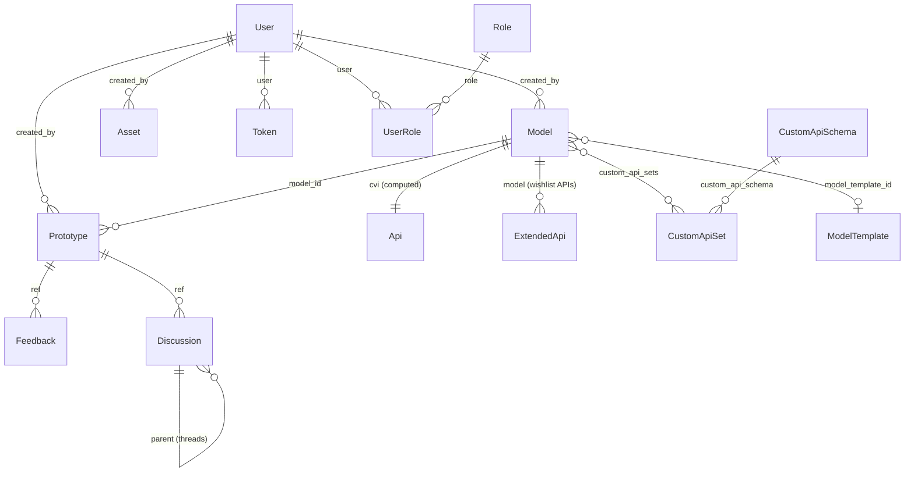

# Data Model

AutoWRX persists to **MongoDB** through **Mongoose 8**. Schemas live in
`backend/src/models/` and are aggregated in `models/index.js`. This document is
the code-verified map of the collections and their relationships.

> The older `backend/docs/db-collections.md` is **partially stale** — it lists an
> `issues` collection and an "inventory" family (`schemas`, `relations`,
> `instances`) that no longer exist (`models/index.js` notes *"Inventory models
> removed"*), and omits several models that do exist (feedbacks, changelogs,
> siteconfigs, plugins, the template family). This document supersedes it.

---

## 1. Shared conventions

Most schemas apply the reusable plugins in `models/plugins/`:

- **`toJSON`** — on serialization: renames `_id → id`, `createdAt → created_at`,
  strips `__v` / `updatedAt`, and drops any field marked `private: true` (e.g.
  `User.password`).
- **`paginate`** — adds `.paginate(filter, options)` supporting `sortBy`,
  `limit` (default `100`), `page`, `fields` projection, and `populate`; returns
  `{ results, page, limit, totalPages, totalResults }`. Comma-separated filter
  values become `$in` arrays.
- **`captureChange`** — writes create / update / delete diffs to the
  `changelogs` collection (updates throttled ~60 s in-memory).

Common fields: `created_by` / `updated_by` are `ObjectId → User`; `timestamps:
true` unless noted.

---

## 2. Entity relationships

---

## 3. Core domain

| Model (file) | Collection | Key fields | Relationships |
|---|---|---|---|
| **User** (`user.model.js`) | `users` | `name`, `email` (unique), `password` (private, bcrypt), `email_verified` (private), `image_file`, `provider`, `provider_user_id`, `provider_data[]` | statics `isEmailTaken`; method `isPasswordMatch` |
| **Model** (`model.model.js`) | `models` | `name`, `main_api`, `visibility` (public/private), `state`, `custom_apis`, `model_files`, `skeleton`, `tags[]`, `extend`, `api_version`, **`custom_template`** (drives model/prototype tabs, plugins) | `created_by → User`, `model_template_id → ModelTemplate`, `custom_api_sets → [CustomApiSet]` |
| **Prototype** (`prototype.model.js`) | `prototypes` | `name`, `apis{VSC,VSS}`, `code`, `widget_config`, `customer_journey`, `description{…}`, `complexity_level` (1–5), `state` (default `development`), `tags[]`, `language`, `flow`, `rated_by` (Map), `editors_choice` | `model_id → Model` (req), `created_by → User` (req); virtual `model` |
| **Api** (`api.model.js`) | `apis` | `cvi` (the computed VSS/CVI tree for a model) | `model → Model`, `created_by → User` |
| **ExtendedApi** (`extendedApi.model.js`) | `extendedapis` | `apiName`, `type`, `datatype`, `unit`, `isWishlist`, `min`/`max`, `allowed[]`, `description` | `model → Model`; **unique `(apiName, model)`** |
| **Asset** (`asset.model.js`) | `assets` | `name`, `type` (e.g. `CLOUD_RUNTIME`, `HARDWARE_KIT`, `GENAI-PYTHON`), `data` | `created_by → User`. **Assets can authenticate** (hold access tokens) |

`custom_template` on a Model is a loosely-typed object that stores the UI
configuration a plugin/tab system reads: `model_tabs`, `prototype_tabs`,
`prototype_sidebar_plugin`, `prototype_tabs_variant`,
`prototype_right_nav_buttons`. See [plugin-system.md](./plugin-system.md).

---

## 4. Auth & authorization

| Model | Collection | Purpose |
|---|---|---|
| **Token** (`token.model.js`) | `tokens` | Persisted **refresh / resetPassword / verifyEmail** tokens (`token`, `type`, `expires`, `blacklisted`) → `user`. Access tokens are **never** stored. No TTL index (expiry checked at verify time). |
| **Role** (`role.model.js`) | `roles` | v1 RBAC role catalog: `name`, `permissions[]`, `ref`, `not_feature` |
| **UserRole** (`userRole.model.js`) | `userroles` | Many-to-many user↔role **scoped by resource** `ref`; unique `(user, role, ref, refType)` |

The authorization logic that reads these is documented in
[auth-security.md](./auth-security.md). A parallel **Casbin**-based policy store
(v2) coexists with this v1 model.

---

## 5. Content, config & templates

| Model | Collection | Notes |
|---|---|---|
| **Discussion** (`discussion.model.js`) | `discussions` | `content`, `ref`, `ref_type`; self-ref `parent → Discussion` (threading) |
| **Feedback** (`feedback.model.js`) | `feedbacks` | `avg_score`, `score{easy_to_use,need_address,relevance}`, `interviewee{…}` → `created_by`, `model_id` |
| **ChangeLog** (`changeLog.model.js`) | `changelogs` | Audit trail (`action` CREATE/UPDATE/DELETE, `changes`, `ref`); written by the `captureChange` plugin. This is a **capped** collection (see the startup cap script). |
| **SiteConfig** (`siteConfig.model.js`) | `siteconfigs` | `key`, `scope` (site/user/model/prototype/api), `target_id`, `value`, `secret`, `category`; unique `(key, scope, target_id)`. Backs `PUBLIC_VIEWING`, theming, feature flags |
| **Plugin** (`plugin.model.js`) | `plugins` | `name`, `slug` (unique), `url`, `is_internal`, `config`, `type` (`prototype_function`/`deploy`) |
| **ModelTemplate** / **DashboardTemplate** / **ProjectTemplate** | `modeltemplates` / `dashboardtemplates` / `projecttemplates` | Reusable model/dashboard/project scaffolds; `visibility`, template-specific config/`widget_config`/`data` |
| **CustomApiSchema** (`customApiSchema.model.js`) | `customapischemas` | Defines a custom API *shape*: `code` (unique), `type` (tree/list/graph), `schema`, `relationships[]` |
| **CustomApiSet** (`customApiSet.model.js`) | `customapisets` | An instance of a schema: `custom_api_schema_code`, `scope`, `data.items[]` (`strict:false` for dynamic fields) → `custom_api_schema`, `owner` |

See [Custom API System](../guides/custom-api-system.md) for how `CustomApiSchema` /
`CustomApiSet` power model-specific API catalogs.

---

*Next: [auth-security.md](./auth-security.md) · [backend.md](./backend.md)*
