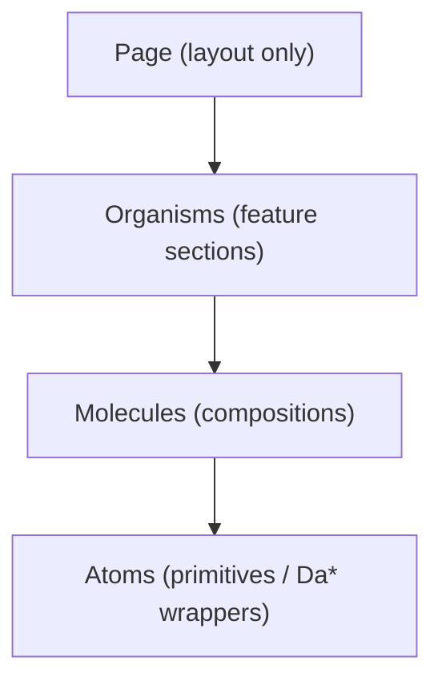

# Frontend Architecture

The frontend is a **React 18 + Vite + TypeScript** single-page app in
`frontend/`. It renders the entire AutoWRX UI, talks to the backend over REST
(`/v2`, cookie-based auth) and Socket.IO (live signals), and hosts
plugin-provided UI through a dynamic component loader.

Runs on **`:3210`** in development (`yarn dev`). See
[README](./README.md) for the stack table.

---

## 1. Component model — atomic design

All components live under `frontend/src/components/`, split into three layers.
Project components are prefixed **`Da`** (digital.auto); lowercase files are
shadcn/Radix-style primitives.

| Layer | Path | Count | Role | Examples |
|---|---|---|---|---|
| **Atoms** | `components/atoms/` | ~44 | Primitives & small wrappers | `button.tsx`, `dialog.tsx`, `DaText.tsx`, `DaInput.tsx`, `DaTabItem.tsx`, `DaStarsRating.tsx`, `JsonEditor.tsx` |
| **Molecules** | `components/molecules/` | ~95 | Compositions of atoms with light logic | `DaNavUser.tsx`, `PrototypeTabs.tsx`, `DaRuntimeConnector.tsx`, `DynamicSchemaForm.tsx`, + subfolders |
| **Organisms** | `components/organisms/` | ~63 | Full feature sections | `NavigationBar.tsx`, `HomeHeroSection.tsx`, `PrototypeTabCode.tsx`, `PluginPageRender.tsx`, `UsersManagement.tsx` |

Molecules also group into feature subfolders: `forms/` (e.g. `FormCreateModel`,
`FormSignIn`), `dashboard/` (`DaDashboard`, `DaDashboardGrid`,
`DaDashboardEditor`, `DaRuntimeControl`), `widgets/`, `genAI/`,
`project_editor/` (`ProjectEditor`, `Editor`, `FileTree`), `toaster/`,
`staging/`, `vehicle_properties/`.

**Composition rule (see [Design Principles](../principles/principle.md)):** pages compose
organisms; organisms compose molecules; molecules compose atoms. Pages hold
layout, not business logic. Example — `pages/PageHome.tsx` arranges
`HomeHeroSection`, `HomeFeatureList`, `HomePrototypeRecent/Popular`, `HomeNews`,
`HomeFooterSection`, `HomePartners`.



---

## 2. Routing & layouts

Bootstrapping (`main.tsx`):

```
BrowserRouter → ErrorBoundary → QueryProvider → ToastContainer → App
```

`App.tsx` calls `useRoutes(routesConfig)` from `configs/routes.tsx`, wraps in
`TooltipProvider`, and installs the plugin bridges `window.reactNavigate` /
`window.reactToast`. Every route element is wrapped in a `SuspenseProvider`;
a few heavy pages (`PageModelList`, `PageVehicleApi`) are `lazy()`-loaded with a
`retry()` helper (`lib/retry.ts`).

**Three layout shells** (`layouts/`):

- **`RootLayout.tsx`** — the global shell for nearly every route. On mount it
  **bootstraps auth** with a silent `POST /auth/refresh-tokens` (sets
  `authBootstrapped`), then renders `NavigationBar`, an optional
  `DaBreadcrumbBar` (skipped for `noBreadcrumbs` routes), the `<Outlet/>`, a
  footer ("Powered by digital.auto" + app version), and the toaster.
- **`ModelDetailLayout.tsx`** — the model workspace shell: the Overview /
  Vehicle API / Prototype Library tab bar plus custom model tabs and addon
  management. Loads the model via `useCurrentModel` and pushes it into
  `modelStore`.
- **`ErrorFallback.tsx`** — error-boundary fallback.

**Route tree** (all under `/` → `RootLayout`, except `*` → `PageNotFound`):

| Path | Element |
|---|---|
| `/` | `PageHome` |
| `/model` | `PageModelList` |
| `/model/:model_id` | `ModelDetailLayout` → `PageModelDetail`, `library/*` → `PagePrototypeLibrary`, `api/*` → `PageVehicleApi`, `plugin` → `PageModelPlugin` |
| `/model/:model_id/library/prototype/:prototype_id/*` | `PagePrototypeDetail` (full-screen, outside `ModelDetailLayout`) |
| `/my-assets`, `/profile`, `/new-prototype` | asset / profile / prototype pages |
| `/admin/*` | `site-config`, `plugins`, `templates`, `dashboard-templates`, `project-templates`, `manage-users` |

---

## 3. State management

The frontend separates **client state** (Zustand) from **server state**
(TanStack Query).

### Client state — Zustand (`stores/`)

Stores use `createWithEqualityFn` (`zustand/traditional`), most with the `immer`
middleware; dev builds mount `simple-zustand-devtools`.

| Store | Holds |
|---|---|
| `authStore` | `access` token (in-memory, **not persisted**), `user`, `openLoginDialog`, `authBootstrapped`; `logOut()` |
| `modelStore` | active `model`, computed API sets (`activeModelApis`, USP, V2C), current `prototype`, unsaved-changes flag; `setActiveModel` derives supported APIs from the CVI |
| `runtimeStore` | live `apisValue`, `traceVars`, `appLog` — drives dashboards & the plugin API bridge |
| `socketStore` | `Map<url, Socket>` — lazily creates/caches Socket.IO connections |
| `globalStore` | UI flags (`isChatShowed`, automation control) |
| `refStore` | keyed DOM-ref registry |
| `githubAuthStore` | GitHub OAuth token — **persisted** to localStorage |

`hooks/useSystemUI.ts` is also a Zustand store (fullscreen / ASIL UI flags).

### Server state — TanStack Query 5

`providers/QueryProvider.tsx` creates one `QueryClient`. A global
`QueryCache.onError` catches **401** and performs a **single-flight token
refresh** (`POST /auth/refresh-tokens`, guarded by `isRefreshing`), then
re-validates queries or calls `logOut()`. Defaults: `staleTime: 30s`, no retry
on 401.

~31 hooks in `hooks/` wrap services in `useQuery`/`useMutation` — e.g.
`useSelfProfile` (`enabled: authBootstrapped && !!accessToken`),
`useCurrentModel`, `useGetPrototype`, `useListAllModel`, `usePermissionHook`,
`useAuthConfigs`.

> **Bridge pattern:** server state is hydrated into client stores where a
> workspace needs shared mutable state — e.g. `ModelDetailLayout` reads
> `useCurrentModel` (Query) and writes it into `modelStore` via `useEffect`.

---

## 4. Services layer (`services/`)

All HTTP goes through **`services/base.ts`**, which exports a configured axios
instance `serverAxios`:

- **Base URL** = `${config.serverBaseUrl}/${config.serverVersion}` →
  `<origin-or-env>/v2` (`configs/config.ts`; `VITE_SERVER_BASE_URL`,
  `VITE_SERVER_VERSION` default `v2`).
- `withCredentials: true` (cookies), and a **request interceptor** injecting
  `Authorization: Bearer <token>` from `authStore`.
- A **response interceptor** that mirrors the Query 401-refresh: on 401 it
  refreshes once (single-flight `isRefreshing` + `failedQueue` to replay pending
  requests), skipping the `/auth/*` endpoints; on failure it logs out.

Each domain has a thin service module of plain functions: `model.service`,
`prototype.service`, `plugin.service`, `auth.service`, `user.service`,
`asset.service`, `permission.service`, `extendedApis.service` (wishlist APIs),
`customApiSet.service`, `configManagement.service`, the `*Template.service`
family, `search`, `upload`, `discussion`, `feedback`, `sso`, `github`, `log`.

---

## 5. Dynamic / config-driven plugin UI

Plugin-provided UI is loaded at runtime by
**`organisms/PluginPageRender.tsx`** (used by `PageModelPlugin`,
`PagePrototypePlugin`, `PageNewPrototypeDetail`, `PrototypeTabStaging`). Outline:

1. **Fetch metadata** — `getPluginBySlug(id)` → the plugin's remote script `url`
   + `config`.
2. **Prime globals** — expose `window.React` / `window.ReactDOM` /
   `window.__PLUGIN_MODULES__` and a `require()` shim so UMD/webpack bundles
   resolve React synchronously.
3. **Inject `<script>`** — append the remote bundle (module first, classic
   fallback); the plugin registers itself at `window.DAPlugins['page-plugin']`.
   The loader polls up to 15 s and caches registrations across unmounts.
4. **Render** — use the plugin's `components.Page`, or wrap its imperative
   `mount(el, props)` / `unmount(el)` API.
5. **Host API bridge** — pass a typed `PluginAPI` (`types/plugin.types`) as
   props `{ data, editable, config, api }`. `api` exposes host capabilities —
   `updateModel`/`updatePrototype`, `getComputedAPIs`, wishlist-API and asset
   CRUD, `uploadFile`, and runtime signal read/write — each gated by permissions
   (`editable` derives from `usePermissionHook(WRITE_MODEL)`), and `config`
   merges **public** site config with plugin config (secrets are never exposed).

The full plugin story — backend records, integration methods, lifecycle — is in
[plugin-system.md](./plugin-system.md).

---

## 6. Styling

**Tailwind CSS v4**, configured CSS-first in `index.css` via
`@import 'tailwindcss'` (no `tailwind.config.js`). Highlights:

- **Design tokens** in an `@theme inline` block map semantic variables
  (`--color-background`, `--color-primary`, `--color-secondary`, `--color-muted`,
  `--color-border`, …) plus the digital.auto palette (`--color-da-primary-*`,
  gray scale). Colors are **OKLCH**.
- Dark mode via `@custom-variant dark (&:is(.dark *))`.
- Base font **Manrope** (plus the `non.geist` font package); a second
  `functional.css` is imported in `main.tsx`.
- `utils/siteConfig.ts` supplies runtime theming defaults (`SITE_THEME_COLOR`,
  logos, `GRADIENT_HEADER`) so an admin can re-skin the instance.

---

## 7. Providers & global bridges

`providers/` holds just `QueryProvider` (Query client + 401 refresh) and
`SuspenseProvider` (thin `<Suspense>`). `BrowserRouter` and `ErrorBoundary` are
inline in `main.tsx`; `TooltipProvider` in `App.tsx`.

Deliberate **global bridges** for plugins and cross-cutting UI:
`window.reactNavigate`, `window.reactToast` (from `App.tsx`), and
`window.DAPlugins` / `window.__PLUGIN_MODULES__` (from `PluginPageRender`).

---

*Next: [backend.md](./backend.md) · [plugin-system.md](./plugin-system.md) ·
[realtime-signals.md](./realtime-signals.md)*
