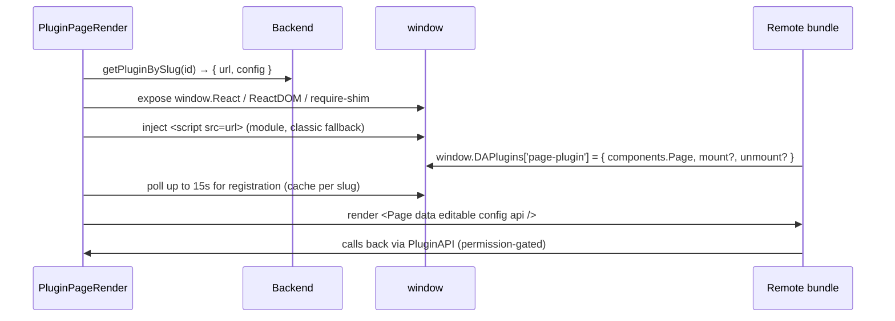

# Plugin System

The plugin system is how AutoWRX stays a **lean core** while most feature surface
lives in **optional, dynamically-loaded extensions**. This document covers the
concept, the backend records, the frontend loader, the host API exposed to
plugins, and the end-to-end lifecycle. It is code-verified — where the intent
docs and the code diverge, the code is authoritative.

For the philosophy see [core-vs-plugin.md](../principles/core-vs-plugin.md) and
[concept.md](../principles/concept.md); for a plugin author's guide see the 6-part
[docs/plugin/](../guides/plugin/README.md).

---

## 1. Concept & reality

The documented design offers **two** integration methods:

1. **npm package** (build-time) — described as the production path.
2. **Dynamic URL loading** (runtime) — fetch a JS bundle from a URL and register
   it.

> **⚠️ Code reality:** only **Dynamic URL loading is implemented.**
> `PluginPageRender.tsx` injects the plugin's `url` as a `<script>` tag; there is
> no npm-import path in the runtime loader. The npm method is documented-only.

The implemented mechanism is a **micro-frontend**: the host injects a remote
script, waits for the plugin to register itself on a global key, then renders the
plugin's component with a controlled set of props. Plugins currently run
**same-origin and unsandboxed** (acknowledged in the docs; iframe sandboxing is
future work).

---

## 2. Backend: what a plugin is

**Model** — `models/plugin.model.js` (`plugins` collection):

| Field | Meaning |
|---|---|
| `name`, `slug` (unique, indexed) | identity; the slug is what tabs reference |
| `url` | the JS bundle location (external CDN, or internal `/plugin/<slug>/…`) |
| `is_internal` | `false` = external URL · `true` = zip uploaded & served by the backend |
| `config` (Mixed) | arbitrary plugin config surfaced to the plugin at render |
| `type` | `prototype_function` (default) or `deploy` |
| `created_by` / `updated_by` | → `User` |

**"System" vs "My" plugins** — there is **no `is_admin` flag**. An *admin/system
plugin* is simply one whose `created_by` holds the **admin role**
(`plugin.service.queryAdminPlugins` resolves this). Edits are ownership-gated:
you must be the creator **or** an admin.

**Routes** — `routes/v2/system/plugin.route.js` (`/system/plugin`): public
`GET /`, `/admin`, `/id/:id`, `/slug/:slug`; authenticated `GET /mine`, `POST /`,
`PUT /:id`, `DELETE /:id`, and `POST /upload/:slug` (multipart) for internal zips.

**Internal-zip flow** (`plugin.controller.uploadInternalPlugin`): the zip is
extracted to `backend/src/static/plugin/<slug>/`, an entry file is auto-detected
(prefers `index.js`, then `index.html`), and the public `url` becomes
`/plugin/<slug>/<entry>` with `is_internal: true`.
*(Note: the admin gate on this route is currently commented out.)*

---

## 3. Frontend: the dynamic loader

`organisms/PluginPageRender.tsx` is the heart of the system. Steps:

1. **Fetch metadata** — `getPluginBySlug(id)` (fallback `getPluginById`);
   requires `url`.
2. **Prime globals** — attach `window.React` / `window.ReactDOM` /
   `window.__PLUGIN_MODULES__` and a `require()` + `__webpack_require__` shim so
   UMD/webpack bundles **share the host's React** instead of bundling their own.
3. **Inject `<script>`** — `crossOrigin="anonymous"`, `type="module"` first with
   a classic-script fallback; execution errors captured via a temporary
   `window.onerror`.
4. **Registration handshake** — every plugin registers under the **single**
   global key `window.DAPlugins['page-plugin']`. Because the key is shared, the
   loader disambiguates with module-level maps (`pluginRegistrations` per
   `plugin_id`, `urlToPluginId`) and **caches registrations across unmounts** so
   switching tabs doesn't re-inject. Poll: up to **15 s**, 100 ms interval.
   *(The `docs/plugin/02-architecture.md` "5 s / 50 attempts" figure is stale.)*
5. **Render** — use `registration.components.Page`, or wrap an imperative
   `mount(el, props)` / `unmount(el)` API in a React component.

---

## 4. The host API (`PluginAPI`)

The plugin receives props `{ data, editable, config, api }`
(`types/plugin.types.ts`). This is a **deliberately narrow** capability surface —
no store, route, token, or filesystem access.

- `editable` = `usePermissionHook([WRITE_MODEL, model_id])` — write methods are
  permission-gated.
- `config` merges **public** site config
  (`configManagementService.getPublicConfigs('site')`) with the plugin's own
  config — **secrets are never exposed** to plugins.
- `api` methods (each conditionally present based on context and permissions):
  - **Model/prototype:** `updateModel`, `updatePrototype` (invalidates the
    `['prototype', id]` query cache).
  - **Vehicle API:** `getComputedAPIs`, `getApiDetail`, `listVSSVersions`,
    `replaceAPIs`.
  - **Runtime values:** `getRuntimeApiValues` / `setRuntimeApiValues` — bridge to
    `runtimeStore` (see [realtime-signals.md](./realtime-signals.md)).
  - **Wishlist APIs, assets, file upload, navigation (`setActiveTab`).**
  - **Kit/runtime files:** `fetchSignalMapping` / `replaceSignalMapping`,
    `fetchVss` / `replaceVss` — these open their **own** Socket.IO connections to
    the external kit server.

Every method wraps its service call with toast feedback and re-throws.

---

## 5. Attaching plugins to models & prototypes

Plugins surface as **tabs/addons** on a model or prototype. `AddonSelect.tsx`
lists **System plugins** (`listAdminPlugins`) and **My plugins**
(`listMyPlugins`); on selection the host writes the plugin's **slug** into the
model's `custom_template`:

- Model tabs → `custom_template.model_tabs` (`ModelDetailLayout.handleAddonSelect`).
- Prototype tabs → `custom_template.prototype_tabs` (normalized via
  `getTabConfig`).

When a custom tab is active, the page mounts `PageModelPlugin` /
`PagePrototypePlugin` → `PluginPageRender` with `plugin_id = <slug>`. See
[data-model.md](./data-model.md) for the `custom_template` shape.

---

## 6. Lifecycle: author → register → attach → render

1. **Author** — build a bundle that sets
   `window.DAPlugins['page-plugin'] = { components: { Page }, mount?, unmount? }`
   and externalizes React (the host provides it).
2. **Register** — create an **external** plugin (a `url`) or upload an
   **internal** zip (served from `/plugin/<slug>/`). Admin-owned plugins appear
   as "System plugins".
3. **Attach** — via `AddonSelect`, the plugin's slug is written into a model's
   `custom_template.model_tabs` / `prototype_tabs` with a display label.
4. **Render** — navigating to the tab mounts `PluginPageRender`, which fetches
   metadata, injects the script, awaits registration (15 s, per-slug cache), and
   renders `Page` with the permission-gated `PluginAPI`.

---

*Next: [realtime-signals.md](./realtime-signals.md) · [frontend.md](./frontend.md)*
