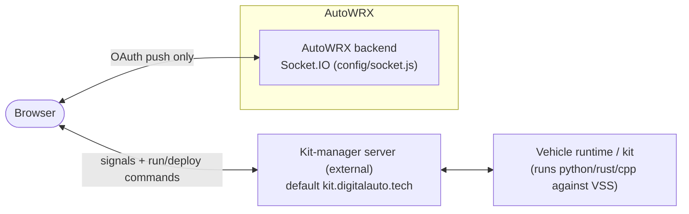

# Realtime Signal Streaming

AutoWRX runs prototype code against live vehicle signals and streams the values
back to dashboards, widgets, and plugins in real time. This document explains
**where** that realtime traffic goes (a common source of confusion) and the
protocol used.

---

## 1. Two separate Socket.IO servers

> **Key fact (code-verified):** live vehicle-signal streaming does **not** go
> through the AutoWRX backend. The browser connects **directly** to an external
> *kit-manager* server. The AutoWRX backend's own Socket.IO is used only for
> authenticated push (e.g. GitHub OAuth results).



- **Backend Socket.IO** (`backend/src/config/socket.js`) — authenticates the
  handshake with an `access_token`, attaches `socket.user`, and then only logs
  connections. It defines **no signal events**. Its sole consumers are
  `listener.service.js` + `auth.service.js`, which push GitHub OAuth results to a
  specific user's socket (`auth/github`).
- **Kit-manager server** (external) — the real signal relay. The frontend talks
  to it via `socket.io-client`.

---

## 2. The signal client — `DaRuntimeConnector`

`components/molecules/DaRuntimeConnector.tsx` connects to the kit server:

- **Server URL** — the `kitServerUrl` prop, resolved by callers from the
  `RUNTIME_SERVER_URL` site config → `config.runtime.url`
  (`https://kit.digitalauto.tech`), overridable by a user's `customKitServer`
  (localStorage). Extra options come from `RUNTIME_SERVER_CONFIG`.
- **Connect / register** — on connect it emits `register_client` `{ username,
  user_id, domain }` (and `unregister_client` on cleanup), then
  `messageToKit { cmd: 'list-all-kits' }` to discover kits.

### Protocol (all multiplexed over `messageToKit` / `messageToKit-kitReply`)

| Direction | Event / `cmd` | Purpose |
|---|---|---|
| C→S | `register_client` | announce the browser client |
| C→S | `list-all-kits` | enumerate available kits (8 s timeout → "Unreachable") |
| C→S | `subscribe_apis` / `unsubscribe_apis` | subscribe only to the APIs a prototype uses (`usedAPIs`) |
| C→S | `run_python_app` / `run_rust_app` / `run_cpp_app`, `stop_python_app`, `deploy_request` | run / stop / deploy prototype code |
| C→S | `write_signals_value`, `set_vars_value` | write a signal/variable value to the kit |
| C→S | `generate_vehicle_model`, `list_mock_signal`, `read_file`, `write_file` | manage the kit's VSS vehicle model, mocks, files |
| S→C | `list-all-kits-result` | the kit list (filtered by `targetPrefix`, default `runtime-`) |
| S→C | `messageToKit-kitReply` → `apis-value` | **the live signal stream** |
| S→C | `messageToKit-kitReply` → `trace_vars`, run/deploy logs, exit codes | execution feedback |

Commands are exposed to the rest of the app through a `useImperativeHandle` ref
(`runApp`, `stopApp`, `deploy`, `writeSignalsValue`, `builldVehicleModel`, …).

### Subscription lifecycle

An effect emits `subscribe_apis { to_kit_id, apis: usedAPIs }` whenever the
active kit / used APIs / a 30 s ticker change, and `unsubscribe_apis` on unmount.
So the browser subscribes **only to the signals a prototype actually references**,
and the kit streams back `apis-value` packets.

---

## 3. The value bus — `runtimeStore`

Live values flow into a single shared Zustand store
(`stores/runtimeStore.ts`: `{ apisValue, traceVars, appLog }`):

```
kit emits `apis-value`
  → DaRuntimeConnector.onKitReply
  → setRawApisPackage → effect → runtimeStore.setActiveApis(result)
  → consumers read useRuntimeStore().apisValue
```

Consumers:

- **`DaApisWatch`** — renders each signal value and lets the user type a new
  value → `writeSignalsValue` back to the kit.
- **Dashboard widgets** (iframes) — receive values via a `postMessage` bridge and
  can write back (`set-api-value` → `writeSignalsValue`).
- **Plugins** — read/write through `PluginAPI.get/setRuntimeApiValues`, backed by
  the same store (see [plugin-system.md](./plugin-system.md)).

---

## 4. Runtime control — `DaRuntimeControl`

`components/molecules/dashboard/DaRuntimeControl.tsx` is the panel that hosts the
connector(s) and drives execution:

- Computes `usedApis` by scanning the prototype `code` + `widget_config` against
  the model's API short-names.
- **Run / Stop** dispatch by language (`runApp` → python/rust/cpp; Rust routes
  through `DaRemoteCompileRust` then `runBinApp`), and broadcast `run-app` /
  `stop-app` to widget iframes.
- Tabs: Terminal (logs), Signals Watch (`DaApisWatch`), Vars Watch, Mock Services
  (`DaMockManager`).
- A config dialog lets the user point at a custom kit server.

---

## 5. What a "kit" / "runtime" is

A **kit / runtime** is a remote vehicle-runtime host registered on the external
kit-manager, identified by `kit_id` (`name`, `is_online`, `last_seen`,
`support_apis`). Naming: `runtime-*` (default prefix), `runtime-public-*`,
`runtime-shared-*`; user-owned kits are matched against `Asset`s of type
`HARDWARE_KIT` / `CLOUD_RUNTIME`. In `forceKitId` mode the connector renders a
status pill: 🟡 Connecting · ⚪ Unreachable · 🔴 Disconnected · 🟢 Connected.

The kit runs prototype code against a **VSS-based vehicle model** it can
(re)generate, and streams/writes signal values. The signal semantics
(`subscribe_apis`, `apis-value`, `write_signals_value`, VSS vehicle model) mirror
the **Eclipse KUKSA / VSS** data-broker model, but there is **no direct KUKSA
client code in this repo** — the browser speaks only the generic `messageToKit`
protocol to the relay, and any KUKSA databroker lives inside the kit, out of
scope here.

---

*Next: [request-lifecycle.md](./request-lifecycle.md) · [frontend.md](./frontend.md)*
