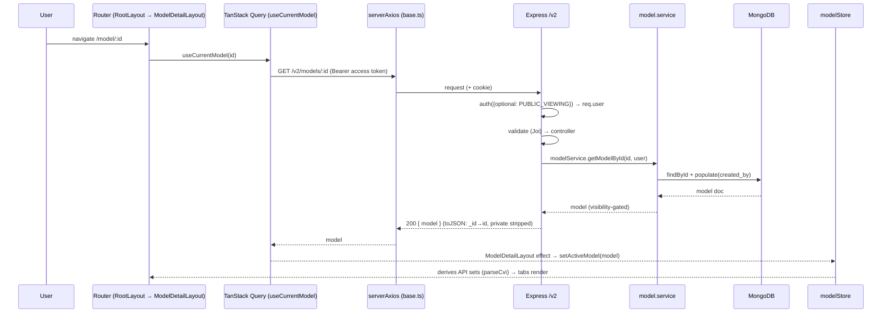
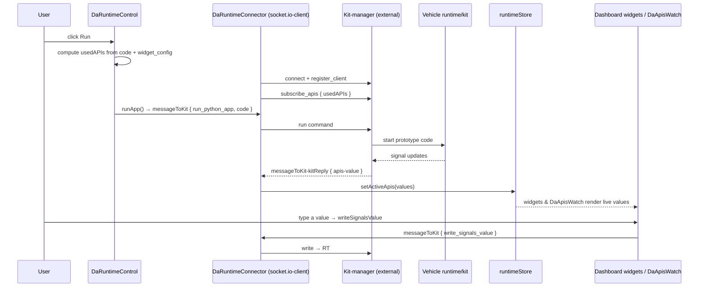

# Request Lifecycle (End-to-End)

The other documents describe each subsystem in isolation. This one **stitches
them together** with two concrete end-to-end traces, so a newcomer can see how
the frontend, backend, database, and realtime layers cooperate.

Read alongside: [frontend.md](./frontend.md), [backend.md](./backend.md),
[auth-security.md](./auth-security.md), [realtime-signals.md](./realtime-signals.md).

---

## 1. Trace A — opening a model page

**Scenario:** a signed-in user navigates to `/model/:model_id`.

What each layer contributes:

1. **Routing** — `RootLayout` (auth bootstrap) wraps `ModelDetailLayout`, which
   owns the model workspace and its tab bar.
2. **Server state** — `useCurrentModel` issues the request through TanStack Query
   (30 s `staleTime`, 401→refresh).
3. **HTTP** — `serverAxios` attaches the Bearer access token and sends the
   refresh cookie (`withCredentials`).
4. **Backend pipeline** — `auth({ optional: PUBLIC_VIEWING }) → validate →
   controller → service → Mongoose`. Public models are readable without a token;
   private ones 401/403. (`optional` may be a boolean or a function of `req`,
   e.g. `(req) => req.authConfig.PUBLIC_VIEWING`.)
5. **Serialization** — the `toJSON` plugin renames `_id → id`, strips private
   fields, and remaps timestamps (`createdAt → created_at`, drops `updatedAt`).
6. **Client state bridge** — `ModelDetailLayout` copies the query result into
   `modelStore`, which derives the supported API sets from the CVI so the rest of
   the workspace shares one source of truth.

---

## 2. Trace B — running a prototype against a live runtime

**Scenario:** in a prototype's dashboard, the user selects a runtime and clicks
**Run**. This is where the **realtime** path diverges from REST.

Key points:

1. **No backend hop for signals** — `DaRuntimeConnector` connects **directly** to
   the external kit-manager (`RUNTIME_SERVER_URL` / `config.runtime.url`), not the
   AutoWRX API. See [realtime-signals.md](./realtime-signals.md).
2. **Targeted subscription** — only the APIs the prototype references
   (`usedAPIs`) are subscribed, and the kit streams `apis-value` packets back.
3. **One value bus** — every consumer (widgets, Signals Watch, plugins) reads and
   writes through `runtimeStore`, so the whole dashboard stays in sync.
4. **Bidirectional** — the browser can also *write* values back to the kit
   (`write_signals_value`), enabling interactive widgets.

---

## 3. Putting it together

| Concern | REST path (Trace A) | Realtime path (Trace B) |
|---|---|---|
| Transport | HTTPS REST `/v2` | Socket.IO to **external** kit server |
| Auth | Bearer access token + refresh cookie | `register_client` handshake |
| Server | AutoWRX Express backend | Kit-manager (out of repo) |
| State | TanStack Query → `modelStore` | `runtimeStore` |
| Persistence | MongoDB | ephemeral (live signals) |

A typical session interleaves both: REST loads the model, prototype, and widget
config; the realtime channel then streams live values into that UI. Plugins can
participate in **both** through the permission-gated `PluginAPI`
(see [plugin-system.md](./plugin-system.md)).

---

*Back to the [architecture overview](./README.md).*
