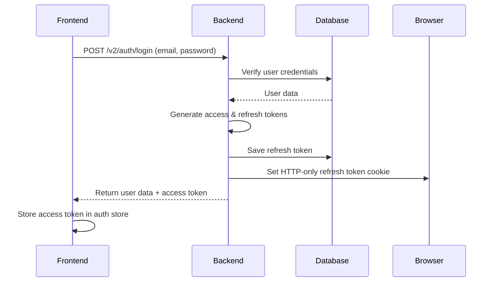
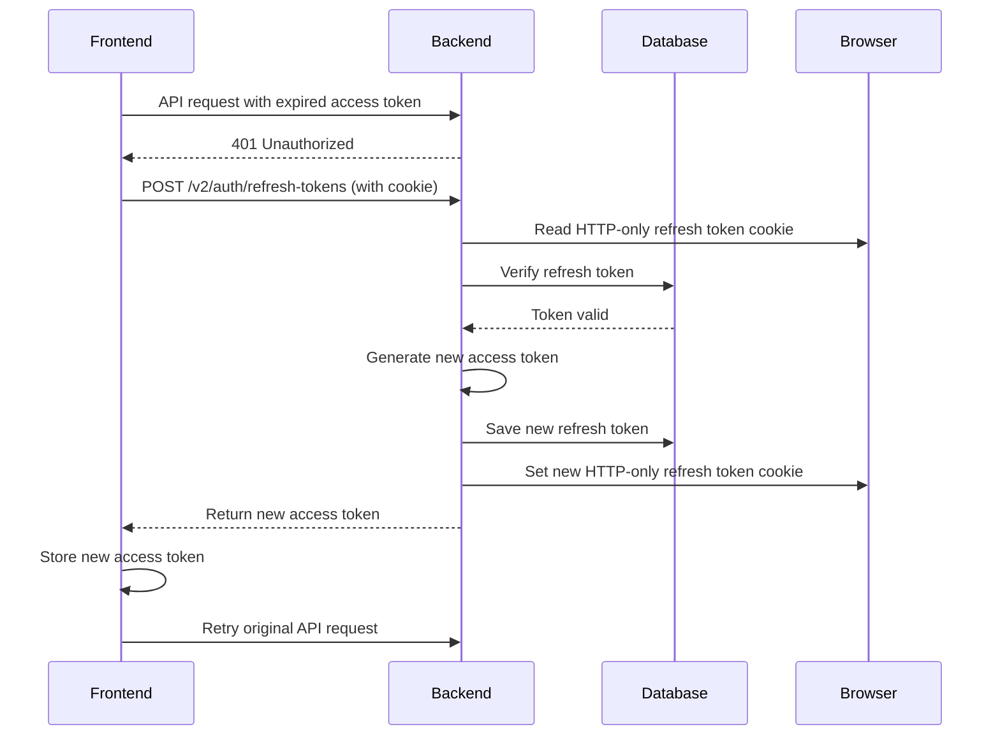
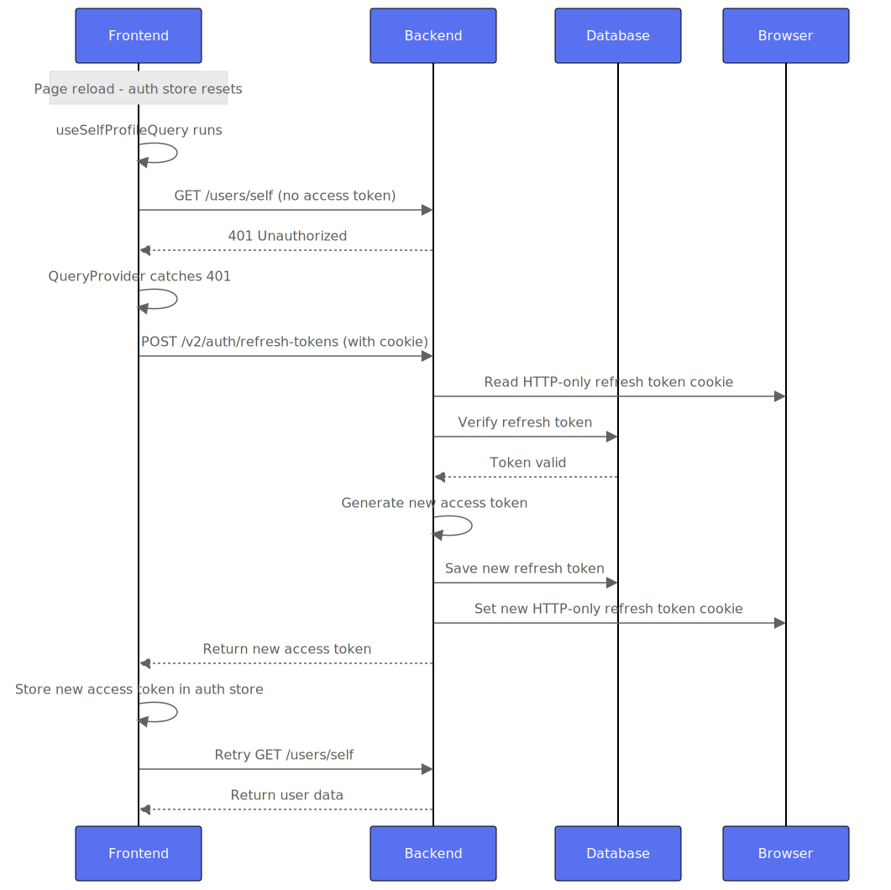

# Authentication & Cookie Handling Documentation

## Overview

This document explains the authentication system, cookie handling, and the fixes implemented to resolve the "unauthorized after page reload" issue in the AutoWRX application.

## Authentication Flow

### 1. Login Process



### 2. Token Refresh Process



### 3. Detailed Refresh Token Flow Diagram

The following diagram shows the complete step-by-step process of what happens during a page reload after successful sign-in:



**Key Points:**
- **Step 1-2**: Page reload resets frontend state, `useSelfProfileQuery` runs automatically
- **Step 3-4**: API call fails with 401 because no access token in memory
- **Step 5**: `QueryProvider` error handler catches 401 and triggers token refresh
- **Step 6-7**: Refresh request sent with HTTP-only cookie containing refresh token
- **Step 8-9**: Backend verifies refresh token in database and generates new tokens
- **Step 10**: New refresh token saved to database and new cookie set
- **Step 11-12**: New access token returned to frontend, stored in auth store, original query retried

## Cookie Configuration

### Production vs Development Settings

The cookie configuration differs between production and development environments:

#### Production (HTTPS)
```javascript
cookie: {
  name: 'token',
  options: {
    secure: true,           // Requires HTTPS
    httpOnly: true,         // Prevents XSS attacks
    sameSite: 'None',       // Allows cross-origin requests
    domain: 'production-domain.com'
  }
}
```

#### Development (HTTP)
```javascript
cookie: {
  name: 'token',
  options: {
    secure: false,          // Allows HTTP for localhost
    httpOnly: true,         // Prevents XSS attacks
    sameSite: 'Lax',        // Allows same-origin requests
    // No domain restriction for localhost
  }
}
```

### Cookie Security Properties

- **`httpOnly: true`**: Prevents JavaScript access to cookies (XSS protection)
- **`secure: true/false`**: Controls whether cookies are sent over HTTPS only
- **`sameSite: 'None'/'Lax'`**: Controls cross-origin cookie behavior
- **`domain`**: Restricts cookie to specific domain (production only)

## Issues & Fixes

### Problem: "Unauthorized after page reload"

**Root Cause**: The local backend was configured with production-grade cookie settings that don't work with HTTP (localhost).

**Symptoms**:
- User successfully logs in
- Page reload shows "unauthorized" 
- Refresh token endpoint returns 401
- Authentication state is lost

### Fix 1: Environment-Specific Cookie Configuration

**File**: `backend/src/config/config.js`

**Before**:
```javascript
cookie: {
  name: envVars.JWT_COOKIE_NAME,
  options: {
    secure: true,           // Always true - breaks localhost
    httpOnly: true,
    sameSite: 'None',       // Always 'None' - requires secure: true
    ...(envVars.NODE_ENV === 'production' && { domain: envVars.JWT_COOKIE_DOMAIN }),
  },
}
```

**After**:
```javascript
cookie: {
  name: envVars.JWT_COOKIE_NAME,
  options: {
    secure: envVars.NODE_ENV === 'production',                    // false for development
    httpOnly: true,
    sameSite: envVars.NODE_ENV === 'production' ? 'None' : 'Lax', // 'Lax' for development
    ...(envVars.NODE_ENV === 'production' && { domain: envVars.JWT_COOKIE_DOMAIN }),
  },
}
```

### Fix 2: Token Verification ObjectId Conversion

**File**: `backend/src/services/token.service.js`

**Problem**: JWT payload contains user ID as string, but MongoDB query expects ObjectId.

**Before**:
```javascript
const verifyToken = async (token, type) => {
  const payload = jwt.verify(token, config.jwt.secret);
  const tokenDoc = await Token.findOne({ 
    token, 
    type, 
    user: payload.sub,  // String - doesn't match ObjectId in DB
    blacklisted: false 
  });
  // ...
};
```

**After**:
```javascript
const verifyToken = async (token, type) => {
  const payload = jwt.verify(token, config.jwt.secret);
  const tokenDoc = await Token.findOne({ 
    token, 
    type, 
    user: new mongoose.Types.ObjectId(payload.sub),  // Convert string to ObjectId
    blacklisted: false 
  });
  // ...
};
```

### Fix 3: Token Saving User ID Format

**File**: `backend/src/services/token.service.js`

**Problem**: Using `user.id` (string) instead of `user._id` (ObjectId) when saving tokens.

**Before**:
```javascript
const generateAuthTokens = async (user) => {
  // ...
  await saveToken(refreshToken, user.id, refreshTokenExpires, tokenTypes.REFRESH);
  // ...
};
```

**After**:
```javascript
const generateAuthTokens = async (user) => {
  // ...
  await saveToken(refreshToken, user._id, refreshTokenExpires, tokenTypes.REFRESH);
  // ...
};
```

## Testing the Fixes

### Local Development Test

1. **Start backend**: `cd backend && npm run dev`
2. **Start frontend**: `cd frontend && npm run dev`
3. **Login**: Use valid credentials
4. **Verify**: Check browser cookies for `token` cookie
5. **Page reload**: Should maintain authentication state
6. **API calls**: Should work without re-authentication

### Production Verification

The production backend at `https://backend-core-dev.digital.auto` works correctly because:
- Uses HTTPS (satisfies `secure: true`)
- Proper CORS configuration
- Correct cookie domain settings

## Frontend Integration

### 1. HTTP Interceptor - Primary Authentication Mechanism

**This is the most important mechanism developers need to understand.** The HTTP interceptor automatically attaches access tokens to all API requests.

**File**: `frontend/src/services/base.ts`

```typescript
import useAuthStore from '@/stores/authStore.ts'
import axios from 'axios'

export const serverAxios = axios.create({
  baseURL: `${config.serverBaseUrl}/${config.serverVersion}`,
  withCredentials: true,  // Important: Enables cookie sending
})

// HTTP Request Interceptor - Automatically adds access token to headers
serverAxios.interceptors.request.use(
  (config) => {
    // Get current access token from auth store
    const token = useAuthStore.getState().access?.token
    
    if (token) {
      // Automatically attach token to Authorization header
      config.headers.Authorization = `Bearer ${token}`
    }
    
    return config
  },
  (error) => {
    return Promise.reject(error)
  },
)
```

**How it works:**
1. **Every API call** using `serverAxios` automatically gets the current access token
2. **No manual token handling** needed in individual components
3. **Automatic header attachment** - developers just use `serverAxios.get()`, `serverAxios.post()`, etc.
4. **Real-time token updates** - when auth store updates, all future requests use the new token

**Usage Example:**
```typescript
// In any component - no manual token handling needed!
import { serverAxios } from '@/services/base'

const fetchUserData = async () => {
  // This automatically includes: Authorization: Bearer <current-token>
  const response = await serverAxios.get('/users/self')
  return response.data
}

const updateProfile = async (data) => {
  // This also automatically includes the token
  const response = await serverAxios.patch('/users/self', data)
  return response.data
}
```

### 2. Authentication State Management

The frontend uses Zustand for state management:

```typescript
// stores/authStore.ts
type AuthState = {
  access?: Token | null
  user: any
  openLoginDialog: boolean
}

// Actions
setAccess: (access: Token) => void
setUser: (user: any, access: Token) => void
logOut: () => void
```

### 3. Token Refresh Integration

The `QueryProvider` handles automatic token refresh:

```typescript
// providers/QueryProvider.tsx
const refreshAuthToken = useCallback(async () => {
  const response = await serverAxios.post<AuthToken>('/auth/refresh-tokens')
  setAccess(response.data.access)
}, [setAccess])

// Automatic refresh on 401 errors
queryCache: new QueryCache({
  onError: async (error, query) => {
    if (isAxiosError(error) && error?.response?.status === 401) {
      await refreshAuthToken()
      queryClient.invalidateQueries({ queryKey: query.queryKey })
    }
  },
})
```

### 4. Other Token Usage Patterns

While the HTTP interceptor handles most cases, some components access tokens directly:

#### A. External API Calls (Manual Token Passing)
```typescript
// components/molecules/ChatBox.tsx
const { access } = useAuthStore()

const sendMessage = async () => {
  const response = await fetch(externalAPIUrl, {
    method: 'POST',
    headers: { 'Content-Type': 'application/json' },
    body: JSON.stringify({
      // ... other data
      token: access?.token || '',  // Manual token passing
    }),
  })
}
```

#### B. Direct Token Access (When Needed)
```typescript
// Any component that needs direct token access
const MyComponent = () => {
  const { access } = useAuthStore()
  
  // Use access?.token when needed
  const token = access?.token
  // ... use token for specific purposes
}
```

#### C. Token Storage (After Login/Refresh)
```typescript
// After successful login or token refresh
const authData = await loginService(email, password)
setAccess(authData.tokens.access)  // Store new token
setUser(authData.user, authData.tokens.access)
```

## Security Considerations

### HTTP-Only Cookies
- Refresh tokens are stored in HTTP-only cookies
- Prevents XSS attacks from stealing tokens
- Only accessible to the server

### Token Rotation
- Each refresh generates a new refresh token
- Old refresh tokens are invalidated
- Limits exposure if a token is compromised

### CORS Configuration
- Backend validates origin headers
- Only allows requests from configured domains
- Prevents unauthorized cross-origin requests

## Troubleshooting

### Common Issues

1. **"Please authenticate" on refresh**
   - Check if refresh token cookie is set
   - Verify cookie configuration matches environment
   - Check MongoDB for saved refresh tokens

2. **Cookies not being set**
   - Verify `secure` setting matches protocol (HTTP vs HTTPS)
   - Check `sameSite` setting for cross-origin requests
   - Ensure proper CORS configuration

3. **Token verification failures**
   - Check ObjectId conversion in `verifyToken`
   - Verify JWT secret configuration
   - Check token expiration settings

### Debug Steps

1. **Check browser cookies**: DevTools → Application → Cookies
2. **Check backend logs**: Look for token saving/verification errors
3. **Check database**: Verify refresh tokens are being saved
4. **Test endpoints**: Use curl to test login/refresh endpoints

## Environment Variables

### Required Environment Variables

```bash
# Backend (.env)
NODE_ENV=development
JWT_SECRET=your-secret-key
JWT_COOKIE_NAME=token
JWT_ACCESS_EXPIRATION_MINUTES=30
JWT_REFRESH_EXPIRATION_DAYS=30
JWT_COOKIE_DOMAIN=your-domain.com  # Production only
```

### Frontend Configuration

```typescript
// configs/config.ts
const config = {
  serverBaseUrl: import.meta.env.VITE_SERVER_BASE_URL || 'http://localhost:3200',
  serverVersion: import.meta.env.VITE_SERVER_VERSION || 'v2',
}
```

## References

- [MDN HTTP Cookies](https://developer.mozilla.org/en-US/docs/Web/HTTP/Cookies)
- [JWT Best Practices](https://tools.ietf.org/html/rfc8725)
- [SameSite Cookie Attribute](https://web.dev/samesite-cookies-explained/)
- [MongoDB ObjectId](https://docs.mongodb.com/manual/reference/method/ObjectId/)
